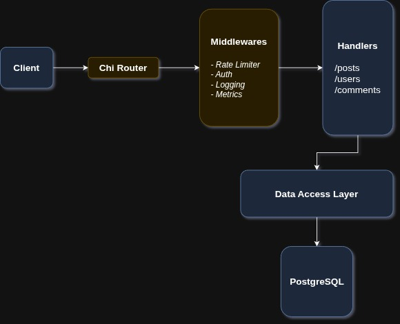

# Go Blog

A production-grade blogging platform built with Go and Chi router. It has features like auth, full-text search, prometheus metrics, email activation, rate limiting, etc. It also features a simple CI workflow that builds the binary, dockerfile and docker compose.

---

## Features

### **Authentication & User Management**

* Registration with email delivery containing an activation code
* Account activation flow
* Secure token-based authentication

### **Post System**

* Full CRUD for posts
* Publish support
* Clapping (voting) mechanism
* PostgreSQL text-search integrated into list endpoint

### **Comments**

* CRUD for post-specific comments
* Protected by user authentication

### **Infrastructure & Middleware**

* Rate limiting per client
* Custom validation layer
* Middlewares for Auth, Metrics, etc
* Database migrations
* Docker & Docker Compose environment
* Prometheus metrics endpoint (`/metrics`)

---

## API Routes

Below is the complete route map of the server:

### Public

| Method | Route                    | Description                 |
| ------ | ------------------------ | --------------------------- |
| GET    | `/healthcheck`           | Server status               |
| POST   | `/users`                 | Register a user             |
| PUT    | `/users/activated`       | Activate user account       |
| POST   | `/tokens/authentication` | Get auth token              |

### Authenticated

All authenticated routes require a valid token and an activated account.

#### Users

| Method | Route       | Description                |
| ------ | ----------- | -------------------------- |
| GET    | `/users/me` | Get current user's profile |

#### Posts

| Method | Route                 | Description                   |
| ------ | --------------------- | ----------------------------- |
| POST   | `/posts`              | Create post                   |
| GET    | `/posts`              | List posts (search & filters) |
| GET    | `/posts/{id}`         | Fetch a post                  |
| PATCH  | `/posts/{id}`         | Update a post                 |
| DELETE | `/posts/{id}`         | Delete a post                 |
| POST   | `/posts/{id}/publish` | Publish a post                |
| POST   | `/posts/{id}/clap`    | Clap(vote) a post             |

#### Comments

| Method | Route                               | Description    |
| ------ | ----------------------------------- | -------------- |
| POST   | `/posts/{id}/comments`              | Create comment |
| GET    | `/posts/{id}/comments`              | List comments  |
| PATCH  | `/posts/{id}/comments/{comment_id}` | Update comment |
| DELETE | `/posts/{id}/comments/{comment_id}` | Delete comment |

---

## Tech Stack

* **Go**
* **Chi Router**
* **PostgreSQL**
* **Go Migrate**
* **Prometheus**
* **Docker & Docker Compose**
* **GitHub Actions**

---

## License

MIT
